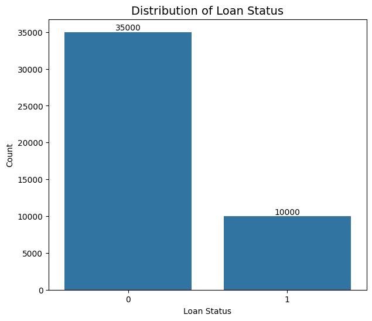
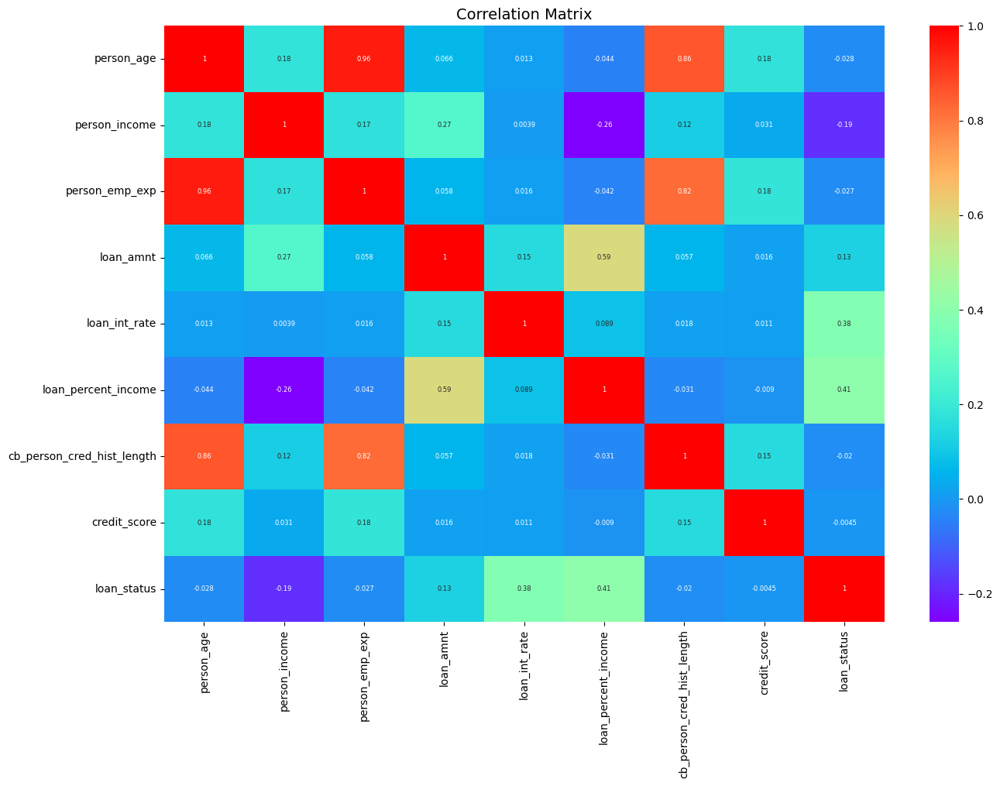
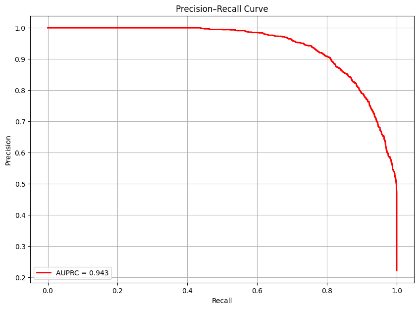
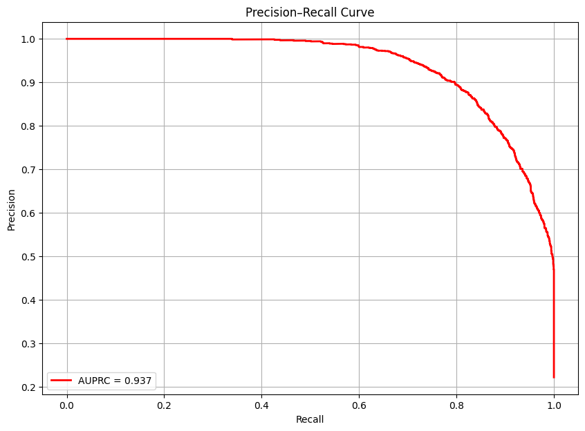
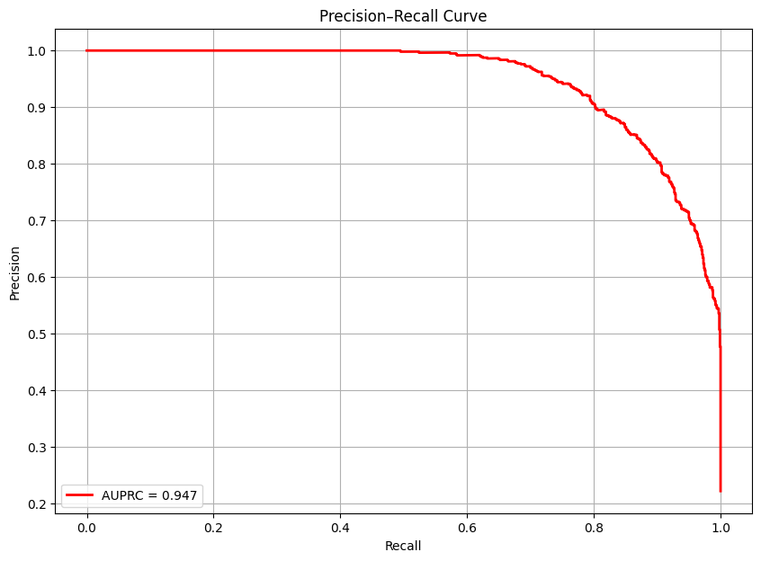

# Loan Approval Prediction System (Gradient Boosting Models)

This project presents a complete end-to-end machine learning workflow designed to predict whether a loan application should be approved or rejected based on applicant and loan characteristics.  
The system evaluates multiple gradient boosting frameworks — Gradient Boosting, XGBoost, LightGBM, and CatBoost — to identify the most efficient and accurate approach for financial decision-making.

---

<strong>1. Project Overview</strong>

**Objective:**  
Develop a predictive model that determines loan approval likelihood using applicant demographics, income, credit, and loan-related attributes.

**Dataset:**  
45,000 borrower records containing:
- Personal attributes (age, gender, education, income, employment experience)  
- Loan details (amount, intent, rate, percent of income)  
- Credit profile (credit score, credit history length, previous defaults)

**Goal:**  
Build and compare multiple Gradient Boosting models for predictive performance and interpretability.

---

<strong>2. Data Exploration</strong>

**Initial Observations:**  
- No missing values or duplicates.  
- Numerical features exhibit skewed distributions, especially income and loan amount.  
- Slight class imbalance in loan status.  

**Key Findings:**  
- Younger borrowers (20–30) have slightly higher default rates.  
- Higher loan interest rates and loan-to-income ratios correlate with greater default risk.  
- Borrowers with longer credit histories are less likely to default.  
- Lower education levels are associated with increased loan rejection.

**Figures:**  
  
  

---

<strong>3. Feature Engineering</strong>

**Encoding:**  
Categorical variables were one-hot encoded using `pd.get_dummies(drop_first=True)` for models requiring numeric inputs.

**Feature Adjustments:**  
- Reversed incorrectly encoded “previous_loan_defaults_on_file” values.  
- Removed highly correlated variables:
  - `person_emp_exp` and `cb_person_cred_hist_length` (redundant with age)  
  - `loan_amnt` (redundant with `loan_percent_income`)  

**Result:**  
A clean, low-multicollinearity dataset prepared for modeling and correlation analysis.

**Figures:**  
  

---

<strong>4. Model Training (Baseline GBM)</strong>

**Base Model:**  
Gradient Boosting Classifier (Scikit-Learn) trained with randomized hyperparameter tuning and 3-fold stratified cross-validation.

**Best Hyperparameters:**  
- Learning Rate: 0.1  
- Max Depth: 11  
- Estimators: 380  
- Training Time: ~34 minutes  

**Performance:**  
- **AUPRC:** 0.943  
- Strong precision even at high recall, indicating robust performance on imbalanced data.

**Figures:**  
  

---

<strong>5. XGBoost Model</strong>

**Highlights:**  
- Achieved AUPRC: **0.940**  
- Training completed in ~71 seconds.  
- Improved computational efficiency with comparable predictive power.

**Top Predictors:**  
- Previous loan defaults  
- Home ownership type  
- Loan interest rate  
- Loan percent income  

**Figures:**  
  

---

<strong>6. LightGBM Model</strong>

**Highlights:**  
- Achieved AUPRC: **0.942**  
- Fastest training (~32 seconds).  
- Prioritized continuous financial variables such as income, credit score, and interest rate.

**Insights:**  
- LightGBM’s leaf-wise growth captured complex non-linear relationships.  
- Financial capacity indicators dominated predictive power.

**Figures:**  
  

---

<strong>7. CatBoost Model</strong>

**Highlights:**  
- Achieved AUPRC: **0.937**  
- Demonstrated stability and strong interpretability.  
- Efficiently handled categorical data without explicit encoding.

**Key Predictors:**  
- Previous defaults  
- Loan percent income  
- Income  
- Interest rate  

**Figures:**  
  

---

<strong>8. CatBoost (Native Categorical Mode)</strong>

**Approach:**  
Re-trained CatBoost directly on raw categorical features using built-in target encoding.

**Performance:**  
- Achieved **AUPRC: 0.947** — best among all models.  
- Captured natural relationships without preprocessing.  
- Simplified pipeline with superior interpretability.

**Figures:**  
  

---

<strong>9. Final Model Comparison</strong>

| Model | AUPRC | Training Time (s) | Notes |
|--------|--------|------------------|--------|
| Gradient Boosting | 0.943 | 2068 | Baseline reference |
| XGBoost | 0.940 | 71 | High speed and accuracy |
| LightGBM | 0.942 | 32 | Fastest with strong results |
| CatBoost | 0.937 | 3732 | Stable with categorical power |
| **CatBoost (Native)** | **0.947** | **Best** | Highest accuracy overall |

**Figures:**  

---

<strong>10. Real-World Context</strong>

This project illustrates how ensemble learning enhances financial decision support systems.  
In practice, such models can help:

- Automate **loan risk assessment** using explainable AI.  
- Enable **faster and fairer lending decisions**.  
- Support **credit scoring** based on behavioral and financial features.

The interactive deployment via **Gradio** allows end-users to simulate loan applications and receive predictions instantly, bridging data science and real-world banking.

---

<strong>11. Tech Stack</strong>

- Python 3.10  
- pandas, numpy, scikit-learn  
- XGBoost, LightGBM, CatBoost  
- seaborn, matplotlib  
- imbalanced-learn, Gradio  

---

<strong>12. Folder Structure</strong>

Loan_Approval_Prediction/  
│  
├── figures/  
│   ├── loan_status_distribution.png  
│   ├── correlation_matrix.png  
│   ├── pr_curve_gbm.png  
│   ├── pr_curve_xgb.png  
│   ├── pr_curve_lgbm.png  
│   ├── pr_curve_cat.png  
│   ├── pr_curve_cat_native.png  
│   └── model_comparison.png  
│  
├── GBT.ipynb                # Main notebook  
├── loan_data.csv            # Dataset  
└── README.md                # Documentation  

---

<strong>13. Conclusion</strong>

This project demonstrates how Gradient Boosting techniques can optimize financial decision-making through high interpretability and predictive accuracy.  
CatBoost’s native categorical handling achieved the strongest results, confirming the model’s suitability for structured data in lending applications.  

Overall, the system integrates **robust modeling, explainability, and deployment** to create a practical, scalable loan approval prediction tool.

---
